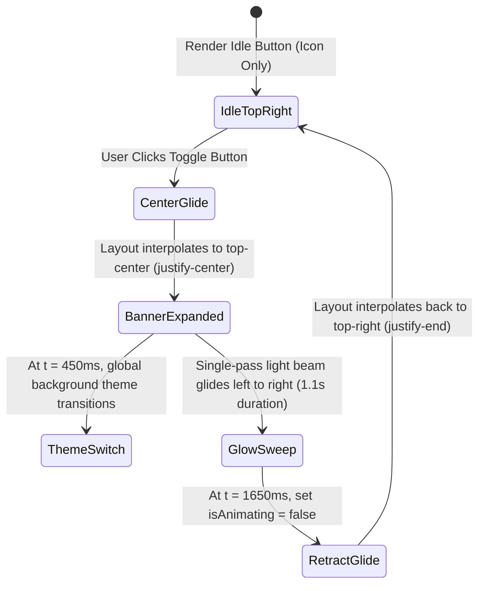

# Animated Theme Toggle & Glow Implementation Summary

This document provides a technical walkthrough of the **`AnimatedThemeToggle`** component built for the Linktree portfolio site. It covers the layout morphing, Framer Motion spring physics, center-screen text reveal, and the single-pass internal light sweep effect.

---

## 🌟 Key Features & Mechanics

1. **Top-Right Default Position**:
   - In its idle state, the button rests cleanly at the **top-right** corner (`top-5 right-5 sm:right-8 z-50`).
   - Compact size (`w-12 h-12 rounded-2xl`) with backdrop blur (`backdrop-blur-xl`), theme-matched glass borders, and subtle hover scale interactions (`scale: 1.08`).

2. **Fluid Center-Top Glide**:
   - Powered by Framer Motion’s **`layout` prop**, enabling hardware-accelerated position interpolation when toggling flex alignment from `justify-end` to `justify-center`.
   - Uses custom spring dynamics (`stiffness: 280, damping: 24, mass: 0.8`) for a smooth, high-end feel without spring overshoot jitter.

3. **Center-Screen Banner & Text Reveal**:
   - Expands horizontally (`px-6 rounded-full`) at the top-center of the screen.
   - Reveals an animated spinning icon (`Sun` for Light mode, `Moon` for Dark mode) alongside the status text: `"Changing theme to "` followed by a styled badge (`LIGHT` / `DARK`).

4. **Single-Pass Internal Light Beam Sweep**:
   - A diagonal gradient light beam (`-skew-x-12`) glides across the inside of the glass card from left to right (`x: '-100%'` ➔ `x: '250%'`).
   - Runs **exactly once** per animation cycle using a 1.1-second duration with continuous opacity fading (`opacity: [0, 1, 1, 0]`).

---

## 📐 Motion State Pipeline



---

## 🎨 Component Source Code (`AnimatedThemeToggle.jsx`)

Below is the complete implementation of the component:

```jsx
import React, { useState } from 'react';
import { motion, AnimatePresence } from 'motion/react';
import { Sun, Moon } from 'lucide-react';

const AnimatedThemeToggle = ({ theme, onToggle }) => {
  const [isAnimating, setIsAnimating] = useState(false);
  const [targetThemeText, setTargetThemeText] = useState('');

  const handleToggle = () => {
    if (isAnimating) return;

    const nextTheme = theme === 'dark' ? 'light' : 'dark';
    const targetLabel = nextTheme === 'light' ? 'Light' : 'Dark';
    setTargetThemeText(targetLabel);
    setIsAnimating(true);

    // Switch theme halfway through center position
    setTimeout(() => {
      onToggle();
    }, 450);

    // Return to top-right after banner display
    setTimeout(() => {
      setIsAnimating(false);
    }, 1650);
  };

  const isDark = theme === 'dark';

  return (
    <div className="fixed top-5 inset-x-0 z-50 pointer-events-none flex justify-center px-4 sm:px-8">
      <div
        className={`w-full max-w-5xl flex items-center transition-all duration-300 ${
          isAnimating ? 'justify-center' : 'justify-end'
        }`}
      >
        <motion.button
          onClick={handleToggle}
          disabled={isAnimating}
          layout
          transition={{
            type: 'spring',
            stiffness: 280,
            damping: 24,
            mass: 0.8,
          }}
          whileHover={!isAnimating ? { scale: 1.08 } : {}}
          whileTap={!isAnimating ? { scale: 0.94 } : {}}
          aria-label={`Switch to ${isDark ? 'light' : 'dark'} theme`}
          className={`pointer-events-auto relative flex items-center justify-center h-12 border backdrop-blur-xl shadow-2xl transition-colors duration-500 cursor-pointer overflow-hidden ${
            isAnimating ? 'px-6 rounded-full' : 'w-12 rounded-2xl'
          } ${
            isDark
              ? 'bg-zinc-900/90 border-zinc-700/80 text-amber-400 shadow-amber-500/15 hover:border-amber-400/60'
              : 'bg-white/90 border-slate-200 text-indigo-600 shadow-indigo-500/15 hover:border-indigo-400/60'
          }`}
        >
          {/* Sweeping Left-to-Right Glow Light Beam (Runs once per animation) */}
          {isAnimating && (
            <motion.div
              initial={{ x: '-100%', opacity: 0 }}
              animate={{ x: '250%', opacity: [0, 1, 1, 0] }}
              transition={{
                duration: 1.1,
                ease: 'easeInOut',
              }}
              className={`absolute inset-y-0 w-1/3 pointer-events-none -skew-x-12 ${
                targetThemeText === 'Light'
                  ? 'bg-gradient-to-r from-transparent via-amber-400/40 to-transparent'
                  : 'bg-gradient-to-r from-transparent via-indigo-400/45 to-transparent'
              }`}
            />
          )}

          <AnimatePresence mode="wait">
            {isAnimating ? (
              <motion.div
                key="banner"
                initial={{ opacity: 0, scale: 0.85 }}
                animate={{ opacity: 1, scale: 1 }}
                exit={{ opacity: 0, scale: 0.85 }}
                transition={{ duration: 0.2 }}
                className="relative z-10 flex items-center gap-2.5 whitespace-nowrap select-none"
              >
                <motion.div
                  animate={{ rotate: 360 }}
                  transition={{ repeat: Infinity, duration: 4, ease: 'linear' }}
                  className="flex items-center justify-center"
                >
                  {targetThemeText === 'Light' ? (
                    <Sun className="w-5 h-5 text-amber-400 drop-shadow-[0_0_8px_rgba(251,191,36,0.6)]" />
                  ) : (
                    <Moon className="w-5 h-5 text-indigo-600 drop-shadow-[0_0_8px_rgba(79,70,229,0.5)]" />
                  )}
                </motion.div>
                <span className="font-mono text-xs sm:text-sm font-semibold tracking-wide flex items-center gap-1.5">
                  <span className={isDark ? 'text-zinc-200' : 'text-slate-800'}>
                    Changing theme to
                  </span>
                  <span
                    className={`px-2.5 py-0.5 rounded-full text-xs font-bold uppercase tracking-wider shadow-sm transition-colors ${
                      targetThemeText === 'Light'
                        ? 'bg-amber-400/20 text-amber-600 dark:text-amber-400 border border-amber-400/30 shadow-amber-500/10'
                        : 'bg-indigo-500/20 text-indigo-600 dark:text-indigo-400 border border-indigo-400/30 shadow-indigo-500/10'
                    }`}
                  >
                    {targetThemeText}
                  </span>
                </span>
              </motion.div>
            ) : (
              <motion.div
                key="icon"
                initial={{ opacity: 0, rotate: -90 }}
                animate={{ opacity: 1, rotate: 0 }}
                exit={{ opacity: 0, rotate: 90 }}
                transition={{ duration: 0.2 }}
                className="flex items-center justify-center"
              >
                {isDark ? (
                  <Sun className="w-5 h-5 text-amber-400 drop-shadow-[0_0_8px_rgba(251,191,36,0.5)]" />
                ) : (
                  <Moon className="w-5 h-5 text-indigo-600 drop-shadow-[0_0_8px_rgba(79,70,229,0.4)]" />
                )}
              </motion.div>
            )}
          </AnimatePresence>
        </motion.button>
      </div>
    </div>
  );
};

export default AnimatedThemeToggle;
```

---

## 🛠️ Key Implementation Details

| Feature | Technical Solution |
| :--- | :--- |
| **Position Motion** | Managed via parent `flex` container toggling `justify-end` ➔ `justify-center` with Framer Motion `layout`. |
| **Light Beam Sweep** | `-skew-x-12` gradient `motion.div` animated from `x: '-100%'` to `x: '250%'` with single-pass `duration: 1.1`. |
| **Icon Rotation** | Sun/Moon icons continuously spin `360deg` while in banner view, and rotate `-90deg` / `90deg` on entrance/exit. |
| **Theme Syncing** | Triggered via `setTimeout(..., 450)` midway through the glide so the background theme shifts while the pill is centered. |
